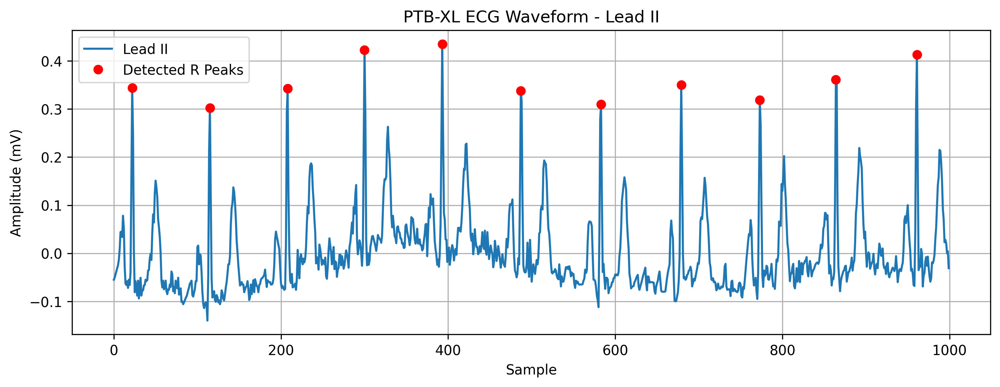
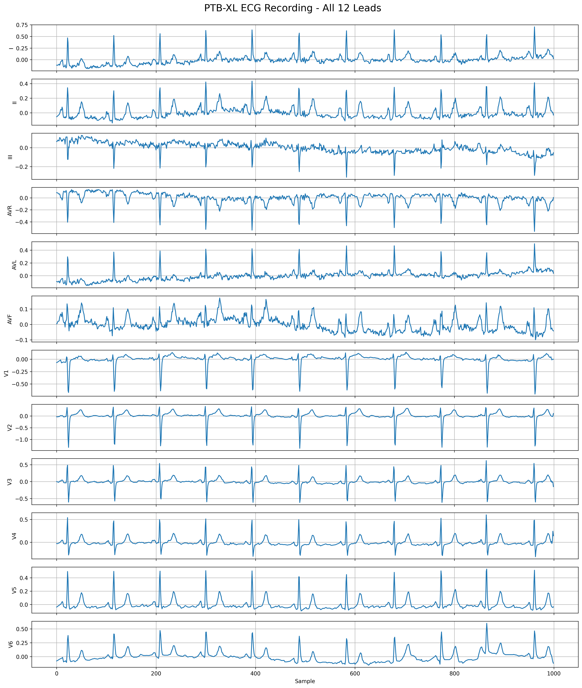
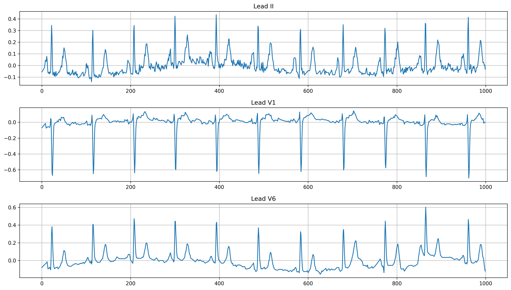

# PTB-XL ECG Exploration

## Project Overview

This project explores real 12-lead ECG data from the PTB-XL dataset hosted on PhysioNet.

The goal was to understand how ECG signals are stored, visualized, and analyzed before applying machine learning or deep learning methods.

This project is for educational purposes and is not intended for clinical diagnosis.

---

## Dataset

- Dataset: PTB-XL
- Source: PhysioNet
- ECG type: Standard 12-lead ECG
- Recording length: 10 seconds
- Sampling rate used: 100 Hz
- Signal shape: 1000 time points × 12 leads

---

## Tasks Completed

- Loaded one PTB-XL ECG record using WFDB
- Inspected the sampling rate and signal dimensions
- Visualized Lead II
- Detected R peaks
- Estimated heart rate
- Visualized all 12 ECG leads
- Compared Lead II, V1, and V6
- Explained why AI models use multiple ECG leads

---

## Lead II and R-Peak Detection

The following figure shows Lead II with detected R peaks.

A total of 11 R peaks were detected over the 10-second recording, corresponding to an estimated heart rate of approximately 66 beats per minute.

---

## All 12 ECG Leads

Although all leads record the same heartbeat, the waveforms differ because each lead observes the heart's electrical activity from a different direction.

---

## Lead Comparison

Lead II is useful for rhythm analysis, while V1 and V6 provide different chest views of ventricular electrical activity.

---

## Why AI Uses 12 Leads

Different cardiac abnormalities may appear in different ECG leads.

By analyzing all 12 leads together, AI models can learn a more complete representation of the heart's electrical activity than they can from a single lead.

---

## Limitations

- Only one ECG recording was explored.
- R-peak detection used a manually selected threshold.
- No machine learning model was trained.
- The project is intended for education only.

---

## Future Work

- Explore more PTB-XL recordings
- Compare normal and abnormal ECGs
- Study PTB-XL diagnostic labels
- Apply ECG preprocessing
- Run an existing pretrained ECG classification model
- Explore deep learning for 12-lead ECG diagnosis

---

## Tools

- Python
- Google Colab
- WFDB
- SciPy
- Matplotlib
- PhysioNet
- GitHub
